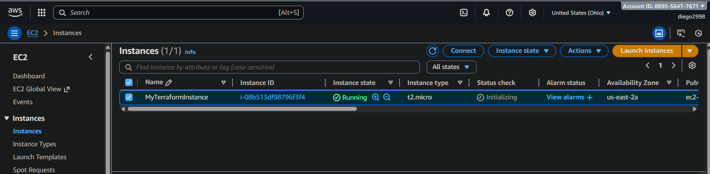

Practical , **Infratructure** with Terraform and AWS. 

# ⭐ **Commands to Set Up Your Terraform Environment.**

### Clone your repo:
---
```sh

git clone https://github.com/Dm2998/terraform-project-VM.git
cd terraform-project-VM
```
---

### Terraform Initialization

Initialize the working directory so Terraform can download the required providers and modules:

```
terraform init 
```

### Terraform Plan 

After initialization, Read the code and the code and then creates and shows a plan of execution/deployment.

terraform plan

### Update the Virtual machine

```bash

sudo apt-get update

```

### Download Terraform

As a best Practice providers should be version in your Terraform config files

```bash
wget https://releases.hashicorp.com/terraform/1.14.0/terraform_1.14.0_linux_amd64.zip

```
<b>

```bash
root@ubuntu-terraform:~# ls
terraform_1.14.0_linux_amd64.zip

root@ubuntu-terraform:~# ls - lrth

root@ubuntu-terraform:~# ls
LICENSE.txt  terraform  terraform.zip

root@ubuntu-terraform:~# cd /usr/local/bin/
root@ubuntu-terraform:/usr/local/bin# ls
terraform

root@ubuntu-terraform:/usr/local/bin# terraform version
Terraform v1.14.0
on linux_amd64
```

### Understanding Terraform Providers

Terraform uses **providers** to interact with different cloud platforms.
Providers act as plugins that Terraform downloads from the **Terraform
Provider Registry**.

- **AWS Provider** → Allows Terraform to create/manage AWS resources  
- **Azure Provider** → Allows Terraform to create/manage Azure resources  

When you run Terraform code from your workstation:

1. Terraform downloads the required provider plugins  
2. Your Terraform configuration communicates with the selected cloud (AWS/Azure)  
3. Terraform creates or updates the infrastructure you defined  


# Terraform Concepts

Here is the diagram:


## Running Terraform from Your Workstation

Terraform uses HashiCorp Configuration Language (HCL) to define infrastructure as code.
From your local machine **(or VS Code)**, Terraform reads the .tf
 files and deploys resources to your cloud provider. **AWS**.

- **Terraform validates the configuration.**

- **Terraform authenticates to your cloud (AWS).**

- **Terraform creates or destroys resources automatically.**


### Diagram


## Terraform Creating an EC2 Instance on AWS.

In this project, Terraform provisions cloud resources inside **Amazon Web Services (AWS)** — specifically an **EC2 virtual machine**.

- **Selecting an AMI (machine image).**

- **Choosing an instance type (e.g., t2.micro).**

- **Creating the VM.**

- **Assigning a public IP.**

- **Both screenshots show the same EC2 instance ID (i-08b513df98796f3f4), verifying that the Terraform-created instance matches the one displayed in the AWS Console.**

# Managing the lifecycle (create / update / destroy)

### Diagram


